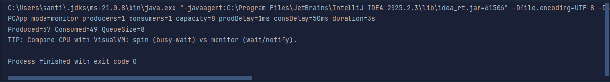
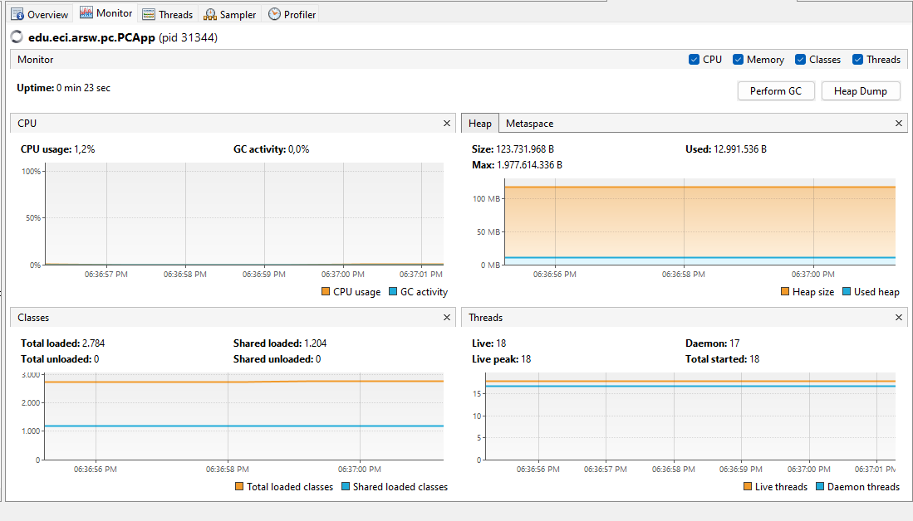

# ARSW — (Java 21): **Immortals & Synchronization** — con UI Swing

**Escuela Colombiana de Ingeniería – Arquitecturas de Software**  
Laboratorio de concurrencia: condiciones de carrera, sincronización, suspensión cooperativa y *deadlocks*, con interfaz **Swing** tipo *Highlander Simulator*.


---

## Requisitos

- **JDK 21** (Temurin recomendado)
- **Maven 3.9+**
- SO: Windows, macOS o Linux

---

## Cómo ejecutar

### Interfaz gráfica (Swing) — *Highlander Simulator*

**Opción A (desde `Main`, modo `ui`)**
```bash
mvn -q -DskipTests exec:java -Dmode=ui -Dcount=8 -Dfight=ordered -Dhealth=100 -Ddamage=10
```

**Opción B (clase de la UI directamente)**
```bash
mvn -q -DskipTests exec:java   -Dexec.mainClass=edu.eci.arsw.highlandersim.ControlFrame   -Dcount=8 -Dfight=ordered -Dhealth=100 -Ddamage=10
```

**Parámetros**  
- `-Dcount=N` → número de inmortales (por defecto 8)  
- `-Dfight=ordered|naive` → estrategia de pelea (`ordered` evita *deadlocks*, `naive` los puede provocar)  
- `-Dhealth`, `-Ddamage` → salud inicial y daño por golpe

### Demos teóricas (sin UI)
```bash
mvn -q -DskipTests exec:java -Dmode=demos -Ddemo=1  # 1 = Deadlock ingenuo
mvn -q -DskipTests exec:java -Dmode=demos -Ddemo=2  # 2 = Orden total (sin deadlock)
mvn -q -DskipTests exec:java -Dmode=demos -Ddemo=3  # 3 = tryLock + timeout (progreso)
```

---

## Controles en la UI

- **Start**: inicia una simulación con los parámetros elegidos.
- **Pause & Check**: pausa **todos** los hilos y muestra salud por inmortal y **suma total** (invariante).
- **Resume**: reanuda la simulación.
- **Stop**: detiene ordenadamente.

**Invariante**: con N jugadores y salud inicial H, la **suma total** de salud debe permanecer constante (salvo durante un update en curso). Usa **Pause & Check** para validarlo.

---

## Arquitectura (carpetas)

```
edu.eci.arsw
├─ app/                 # Bootstrap (Main): modes ui|immortals|demos
├─ highlandersim/       # UI Swing: ControlFrame (Start, Pause & Check, Resume, Stop)
├─ immortals/           # Dominio: Immortal, ImmortalManager, ScoreBoard
├─ concurrency/         # PauseController (Lock/Condition; paused(), awaitIfPaused())
├─ demos/               # DeadlockDemo, OrderedTransferDemo, TryLockTransferDemo
└─ core/                # BankAccount, TransferService (para demos teóricas)
```

---

# Actividades del laboratorio

## Parte I — (Antes de terminar la clase) `wait/notify`: Productor/Consumidor
1. Ejecuta el programa de productor/consumidor y monitorea CPU con **jVisualVM**. ¿Por qué el consumo alto? ¿Qué clase lo causa?  
2. Ajusta la implementación para **usar CPU eficientemente** cuando el **productor es lento** y el **consumidor es rápido**. Valida de nuevo con VisualVM.  
3. Ahora **productor rápido** y **consumidor lento** con **límite de stock** (cola acotada): garantiza que el límite se respete **sin espera activa** y valida CPU con un stock pequeño.

> Nota: la Parte I se realiza en el repositorio dedicado https://github.com/DECSIS-ECI/Lab_busy_wait_vs_wait_notify — clona ese repo y realiza los ejercicios allí; contiene el código de productor/consumidor, variantes con busy-wait y las soluciones usando wait()/notify(), además de instrucciones para ejecutar y validar con jVisualVM.


> Usa monitores de Java: **`synchronized` + `wait()` + `notify/notifyAll()`**, evitando *busy-wait*.

---

## Parte II — (Antes de terminar la clase) Búsqueda distribuida y condición de parada
Reescribe el **buscador de listas negras** para que la búsqueda **se detenga tan pronto** el conjunto de hilos detecte el número de ocurrencias que definen si el host es confiable o no (`BLACK_LIST_ALARM_COUNT`). Debe:
- **Finalizar anticipadamente** (no recorrer servidores restantes) y **retornar** el resultado.  
- Garantizar **ausencia de condiciones de carrera** sobre el contador compartido.

> Puedes usar `AtomicInteger` o sincronización mínima sobre la región crítica del contador.

---

## Parte III — (Avance) Sincronización y *Deadlocks* con *Highlander Simulator*
1. Revisa la simulación: N inmortales; cada uno **ataca** a otro. El que ataca **resta M** al contrincante y **suma M/2** a su propia vida.  
2. **Invariante**: con N y salud inicial `H`, la suma total debería permanecer constante (salvo durante un update). Calcula ese valor y úsalo para validar.  
3. Ejecuta la UI y prueba **“Pause & Check”**. ¿Se cumple el invariante? Explica.  
4. **Pausa correcta**: asegura que **todos** los hilos queden pausados **antes** de leer/imprimir la salud; implementa **Resume** (ya disponible).  
5. Haz *click* repetido y valida consistencia. ¿Se mantiene el invariante?  
6. **Regiones críticas**: identifica y sincroniza las secciones de pelea para evitar carreras; si usas múltiples *locks*, anida con **orden consistente**:
   ```java
   synchronized (lockA) {
     synchronized (lockB) {
       // ...
     }
   }
   ```
7. Si la app se **detiene** (posible *deadlock*), usa **`jps`** y **`jstack`** para diagnosticar.  
8. Aplica una **estrategia** para corregir el *deadlock* (p. ej., **orden total** por nombre/id, o **`tryLock(timeout)`** con reintentos y *backoff*).  
9. Valida con **N=100, 1000 o 10000** inmortales. Si falla el invariante, revisa la pausa y las regiones críticas.  
10. **Remover inmortales muertos** sin bloquear la simulación: analiza si crea una **condición de carrera** con muchos hilos y corrige **sin sincronización global** (colección concurrente o enfoque *lock-free*).  
11. Implementa completamente **STOP** (apagado ordenado).

---

## Entregables

1. **Código fuente** (Java 21) con la UI funcionando.  
2. **`Informe de laboratorio en formato pdf`** con:
   - Parte I: diagnóstico de CPU y cambios para eliminar espera activa.  
   - Parte II: diseño de **parada temprana** y cómo evitas condiciones de carrera en el contador.  
   - Parte III:  
     - Regiones críticas y estrategia adoptada (**orden total** o **tryLock+timeout**).  
     - Evidencia de *deadlock* (si ocurrió) con `jstack` y corrección aplicada.  
     - Validación del **invariante** con **Pause & Check** (distintos N).  
     - Estrategia para **remover inmortales muertos** sin sincronización global.
3. Instrucciones de ejecución si cambias *defaults*.

---

## Criterios de evaluación (10 pts)

- (3) **Concurrencia correcta**: sin *data races*; sincronización bien localizada; no hay espera activa.  
- (2) **Pausa/Reanudar**: consistencia del estado e invariante bajo **Pause & Check**.  
- (2) **Robustez**: corre con N alto; sin `ConcurrentModificationException`, sin *deadlocks* no gestionados.  
- (1.5) **Calidad**: arquitectura clara, nombres y comentarios; separación UI/lógica.  
- (1.5) **Documentación**: **`RESPUESTAS.txt`** claro con evidencia (dumps/capturas) y justificación técnica.

---

## Tips y configuración útil

- **Estrategias de pelea**:  
  - `-Dfight=naive` → útil para **reproducir** carreras y *deadlocks*.  
  - `-Dfight=ordered` → **evita** *deadlocks* (orden total por nombre/id).
- **Pausa cooperativa**: usa `PauseController` (Lock/Condition), **sin** `suspend/resume/stop`.  
- **Colecciones**: evita estructuras no seguras; prefiere inmutabilidad o colecciones concurrentes.  
- **Diagnóstico**: `jps`, `jstack`, **jVisualVM**; revisa *thread dumps* cuando sospeches *deadlock*.  
- **Virtual Threads**: favorecen esperar con bloqueo (no *busy-wait*); usa timeouts.

---

## Cómo correr pruebas

```bash
mvn clean verify
```

Incluye compilación y pruebas JUnit.

---
## Informe del Laboratorio

### Parte I — Productor/Consumidor

1. **Ejecuta el programa de productor/consumidor y monitorea CPU con jVisualVM. ¿Por qué el consumo alto? ¿Qué clase lo causa?**

De acuerdo con el monitoreo, el consumo alto de CPU se debe a la implementación de **busy-wait** en la clase `BusySpinQueue`, donde los hilos productores y consumidores están constantemente verificando el estado del buffer sin ceder el control, lo que genera un uso intensivo de CPU.

```java
public void put(T item) {
    // spin hasta que haya espacio
    while (true) {
        if (q.size() < capacity) {
            q.addLast(item);
            return;
        }
        // espera activa
        Thread.onSpinWait();
    }
}

public T take() {
    // spin hasta que haya elementos
    while (true) {
        T v = q.pollFirst();
        if (v != null)
            return v;
        Thread.onSpinWait();
    }
}
```

Como se puede observar, ambos métodos `put` y `take` utilizan un bucle infinito para verificar constantemente el estado del buffer, lo que resulta en un alto consumo de CPU.

#### Ejemplo de consumo de CPU (jVisualVM)

- 
- 

2. **Ajusta la implementación para usar CPU eficientemente cuando el productor es lento y el consumidor es rápido. Valida de nuevo con VisualVM.**

    Para optimizar el uso de CPU, se implementa una clase llamada `BoundedBuffer` utilizando **monitores** con `wait()` y `notifyAll()`. Esto permite a los hilos productores y consumidores esperar de manera eficiente sin consumir CPU mientras esperan.

    ```java
    public void put(T item) throws InterruptedException {
        synchronized (this) {
            while (q.size() == capacity) {
                this.wait(); // espera hasta que haya espacio
            }
            q.addLast(item);
            this.notifyAll(); // despierta consumidores
        }
    }

    public T take() throws InterruptedException {
        synchronized (this) {
            while (q.isEmpty()) {
                this.wait(); // espera hasta que haya elementos
            }
            T v = q.removeFirst();
            this.notifyAll(); // despierta productores
            return v;
        }
    }
    ```

    Como resultado, el consumo de CPU disminuye notablemente, ya que los hilos solo se activan cuando hay cambios en el buffer, evitando la espera activa.
    Además,por defecto el productor tiene un delay de 50ms, mientras que el consumidor tiene un delay de 1ms, lo que hace que el productor sea lento y el consumidor rápido, validando así el escenario planteado. En este caso se disminuyó el delay del productor a 30ms para aumentar la diferencia entre ambos y evidenciar mejor el consumo de CPU.
    
    #### Ejemplo de consumo de CPU tras optimización (jVisualVM)
    
    - 
    - 
3.  **Ahora productor rápido y consumidor lento con límite de stock (cola acotada): garantiza que el límite se respete sin espera activa y valida CPU con un stock pequeño.**

Para este escenario, se mantiene la implementación de `BoundedBuffer` con monitores. Se ajustan los delays para que el productor sea rápido (1ms) y el consumidor lento (50ms), y se establece una capacidad pequeña para el buffer.

```java
String mode = System.getProperty("mode", "monitor"); // monitor|spin
int producers = Integer.getInteger("producers", 1);
int consumers = Integer.getInteger("consumers", 1);
int capacity = Integer.getInteger("capacity", 8);
long prodDelay = Long.getLong("prodDelayMs", 1);
long consDelay = Long.getLong("consDelayMs", 50);
int duration = Integer.getInteger("durationSec", 3);
```

Al ejecutar el programa con estos parámetros, se observa que el productor respeta el límite de stock sin utilizar espera activa, y el consumo de CPU sigue siendo eficiente. Además, al finalizar el programa hay elementos que se quedaron en el buffer, lo que indica que el productor fue más rápido que el consumidor.

#### Ejemplo de consumo de CPU con stock pequeño y elementos en Buffer

- 
- 

## Créditos y licencia

Laboratorio basado en el enunciado histórico del curso (Highlander, Productor/Consumidor, Búsqueda distribuida), modernizado a **Java 21**.  
<a rel="license" href="http://creativecommons.org/licenses/by-nc/4.0/"></a><br />Este contenido hace parte del curso Arquitecturas de Software (ECI) y está licenciado como <a rel="license" href="http://creativecommons.org/licenses/by-nc/4.0/">Creative Commons Attribution-NonCommercial 4.0 International License</a>.
